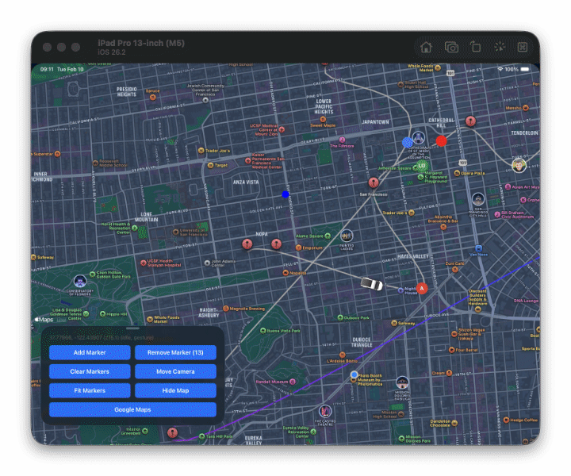

# @lugg/maps

Universal maps for your React Native apps 📍



> [!IMPORTANT]
> This library is currently under heavy development. APIs may change without notice.

## Documentation

Full documentation lives at **[maps.lodev09.com](https://maps.lodev09.com)**.

- [Installation](https://maps.lodev09.com/docs/installation) - Expo, bare React Native, and web setup
- [Usage](https://maps.lodev09.com/docs/usage) - Render your first map
- [MapView](https://maps.lodev09.com/docs/components/map-view) - Props, camera methods, events, static maps
- [Marker](https://maps.lodev09.com/docs/components/marker) - Custom views, callouts, dragging
- [Polyline](https://maps.lodev09.com/docs/components/polyline), [Polygon](https://maps.lodev09.com/docs/components/polygon), [Circle](https://maps.lodev09.com/docs/components/circle) - Shapes
- [GeoJson](https://maps.lodev09.com/docs/components/geojson), [GroundOverlay](https://maps.lodev09.com/docs/components/ground-overlay), [TileOverlay](https://maps.lodev09.com/docs/components/tile-overlay) - Data and overlays
- [Types](https://maps.lodev09.com/docs/types) - `Coordinate`, `Point`, `EdgeInsets`

## Quick start

```sh
npm install @lugg/maps
```

```tsx
import { MapView, Marker } from '@lugg/maps';

<MapView
  style={{ flex: 1 }}
  provider="google"
  initialCoordinate={{ latitude: 37.7749, longitude: -122.4194 }}
  initialZoom={12}
>
  <Marker
    coordinate={{ latitude: 37.7749, longitude: -122.4194 }}
    title="San Francisco"
  />
</MapView>
```

Google Maps needs an API key on every platform. See [Installation](https://maps.lodev09.com/docs/installation) for Expo, iOS, Android, and web setup.

## Contributing

- [Development workflow](CONTRIBUTING.md#development-workflow)
- [Sending a pull request](CONTRIBUTING.md#sending-a-pull-request)
- [Code of conduct](CODE_OF_CONDUCT.md)

## License

MIT
